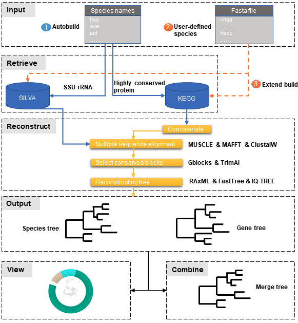

# PhySpeTree: an automated pipeline for reconstructing phylogenetic species trees

**PhySpeTree is implemented in Python language (supports Python2.7+ and Python3+), designed for Linux systems (docker for Windows OS or Mac OS).**

## Introduction

Understanding phylogenetic relationships between different species is crucial for evolutionary studies. Reconstructing the
phylogenetic species tree, a branching diagram, is particularly useful in inferring evolutionary relationships. For example,
the tree-of-life provides a remarkable view of organizing principles of the biological world. In addition, because new organisms 
are being sequenced, by integrating them to already built species trees, it is important to determine their taxonomic identities. 
Moreover, combining with gain/loss homologous information, species trees are widely applied in predicting new members of 
protein complexes and protein-protein interactions.

Here, we developed an easy-to-use package named PhySpeTree that is convenient to reconstruct species trees by one command line.
Two independent pipelines were included by using the most adopted small subunit ribosomal RNA (SSU rRNA) and concatenated highly
conserved proteins (HCP), respectively. A distinct advantage is that users only need to input species names and PhySpeTree
automatically downloads and analyzes sequences of SSU rRNA about 140,662 species and  HCP about 5,900 organisms.

## Workflow





- ① Automatic tree reconstruction.

- ② Processing user-defined fasta files for unannotated organisms.

- ③ Reconstructing species trees with unannotated organisms.

## Features

- Inputs only include species names.

- One command line to build trees.

- HCP and SSU rRNA methods.

- Combine trees.

- View trees with iTOL.

- Versatile software with adjustable parameters.

## Modules

* [autobuild](usage.md#autobuild): automatically reconstruct phylogenetic tree

```bash
PhySpeTree autobuild -i species_name_list.txt --hcp
```


* [build](usage.md#build): reconstruct phylogenetic tree with manually prepared sequences

```bash
PhySpeTree build -i species.fasta -o --multiple
```

* [combine](usage.md#combine): combine multiple trees

```bash
PhySpeTree combine -i multiple_tree.tree -o Output
```

* [iview](usage.md#iview): view and annotate trees with iTOL

```bash
PhySpeTree iview -i species_name_list.txt -o ivew -range phylum 
```

* [check](usage.md#check):check user-defined organisms

```
PhySpeTree check -i organisms.txt -o checkout --protein
```

[1]: example/organism_example_list.txt

> Cite: Fang, Y., Liu, C., Lin, J. et al. PhySpeTree: an automated pipeline for reconstructing phylogenetic species trees.
> BMC Evol Biol 19, 219 (2019) doi:10.1186/s12862-019-1541-x